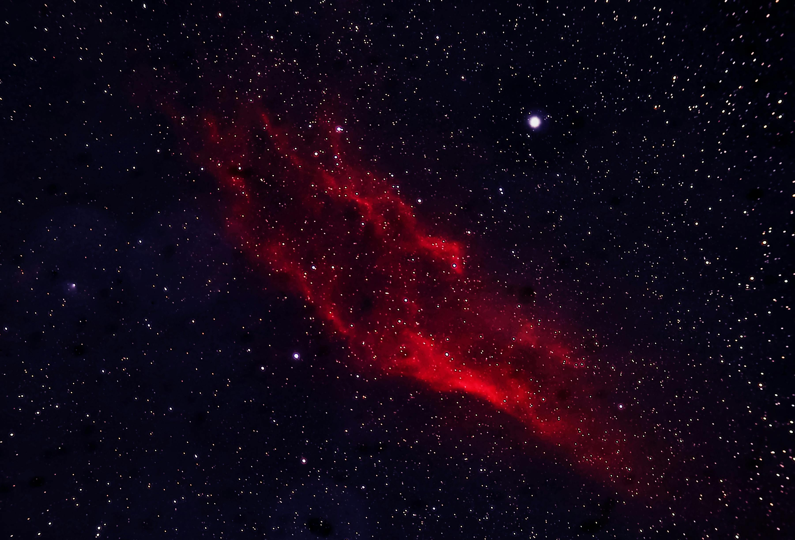

# Clasificador de estrellas

Aplicación web hecha en Streamlit que carga un modelo de IA y clasifica estrellas en función de su temperatura, luminosidad, radio y magnitud.

Aplicación web desplegada:
